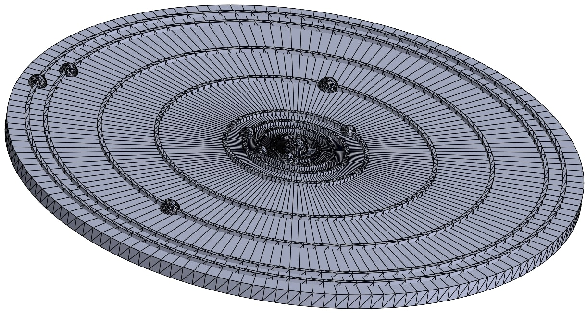

# README
# Planetary Positioning Project!

The Planets posistion at any given date by input.
  
This project visualizes the positions of planets in the solar system for a given date.
  
It generates 2D and 3D plots of the planetary positions and creates a 3D model of the solar system saved as an STL file.
  

## This project is licensed under the MIT License. See the LICENSE file for details.

## Installation

1. Clone the repository:
   git clone https://github.com/RuHelg/Planetary-Positions-Project.git
   cd Planetary-Positions-Project

2. Create and activate a virtual environment::
   python -m venv .venv
   .venv\Scripts\activate  # On Windows
   # source .venv/bin/activate  # On macOS/Linux

3. Install the required dependencies:
   Install python dependencies using `pip install -r requirements.txt`

## Create Planetary position plot:

1. Run the GUI to input the desired date and text:
   Execute the program by using `python gui.py`

2. Follow the instructions and enter:
   Desired date and text

You will now have a STL file ready for slicing using Cura or another 3D printer software.
